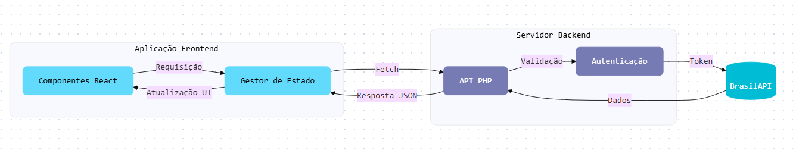

# Brasil API Client

Este projeto é um cliente para a [BrasilAPI](https://brasilapi.com.br/), permitindo consultar dados públicos do Brasil, como informações de CEP, bancos, CNPJ, entre outros.

## Sobre

O objetivo deste projeto é facilitar o consumo da BrasilAPI em aplicações PHP, fornecendo uma interface simples para realizar requisições e tratar respostas.

## Estrutura de Pastas

```
brasil-api-client/
├── backend/       # Código-fonte principal do cliente PHP e integrações com BrasilAPI
├── frontend/      # Interface web ou exemplos de uso em aplicações frontend
├── fluxo.png      # Imagem explicando o fluxo do funcionamento
├── README.md      # Este arquivo
└── ...            # Outros arquivos e pastas
```

- **backend/**: Contém todo o código PHP responsável por consumir a BrasilAPI, além dos testes automatizados.
- **frontend/**: Destinada a exemplos de integração, interface web ou qualquer recurso relacionado ao uso do cliente no frontend.

## Como Usar

1. Clone o repositório:
   ```bash
   git clone https://github.com/seu-usuario/brasil-api-client.git
   ```

2. Instale as dependências (se houver):
   ```bash
   composer install
   ```

3. Utilize o cliente em seu projeto PHP:
   ```php
   require 'src/BrasilApiClient.php';

   $client = new BrasilApiClient();
   $cepInfo = $client->getCep('01001-000');
   print_r($cepInfo);
   ```

## Exemplo de Fluxo

Abaixo está uma imagem que ilustra o fluxo de funcionamento do cliente:


